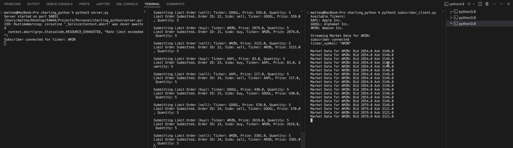

# 🚀 A Financial Market in Python with gRPC Technology

This is an experimental project that showcases the integration of **gRPC** and **asyncio** to simulate a real-time financial market environment. 

## 💡 Project Overview
The main objective of this project is to create a fully functional, asynchronous market server using Python, where clients can submit orders and retrieve order book data in real-time using **gRPC**. The project consists of:
1. A **market server** that manages the order book and handles client requests.
2. A **client** that submits multiple types of orders (limit/market).
3. A **subscriber client** that streams live updates from the order book.

This project is designed as a foundation for more complex financial simulations, algorithmic trading systems, or simply for learning purposes.

---

## 📖 How to Use It
The setup involves three main components:
1. **Server**: The core of the system, maintaining the order book and broadcasting market updates.
2. **Order Client**: A client to submit limit or market orders.
3. **Subscriber Client**: A client that subscribes to the order book and receives real-time market updates.

### Running the Project
To use the project, trigger the following sequence:
1. Start the server.
2. Run the order submission client.
3. Run the subscriber client to receive updates from the order book.

Here's a basic example of how it works:

Feel free to download this project as a starting point for further development.

---

## ⚙️ Technical Implementation

### 🔥 Order Book with Heap Queue Algorithm
The **order book** is the heart of this market server, implemented using Python’s `heapq` (heap queue) algorithm to manage buy and sell orders efficiently. 

- **Buy Orders (Max-Heap)**: For buy orders, we use a max-heap to ensure that the highest bid is always at the top. This is achieved by storing prices as negative values to reverse the default min-heap behavior of Python’s `heapq`.
- **Sell Orders (Min-Heap)**: Sell orders are maintained in a min-heap so that the lowest ask price is always prioritized for execution.
- **Order Matching**: When an order is submitted, the system checks if there’s an opposing order that can fulfill it. If the prices match or overlap, the trade is executed, and the quantities are adjusted accordingly.

The heap queue allows for efficient sorting and retrieval, ensuring that both the insertion of orders and the matching process are highly optimized.

### 🚀 gRPC with Protocol Buffers: Why gRPC Over REST?
In this project, we leverage **gRPC** with **Protocol Buffers** to handle communication between the client and server. Here’s why this approach is superior to traditional RESTful APIs:

- **High Performance**: gRPC uses **binary serialization** via Protocol Buffers, which is significantly more compact and faster than JSON or XML used in REST APIs. This reduces both the payload size and parsing time, making it ideal for real-time financial data.
- **Streaming Support**: Unlike REST, gRPC natively supports **bi-directional streaming**, which allows clients to subscribe to continuous real-time updates (such as an order book) without needing to poll the server repeatedly.
- **Type Safety**: Protocol Buffers enforce strong types, ensuring that both client and server have a clear contract for communication. This reduces the chance of data inconsistencies and bugs.
- **Efficient Communication**: gRPC operates over HTTP/2, providing features like multiplexing, header compression, and low-latency connections.

By using gRPC, the project can handle large volumes of order submissions and market data updates much more efficiently than with a REST-based approach.

### ⚡ Asyncio for Concurrent Operations
The server is fully implemented with **asyncio**, Python’s native library for asynchronous I/O. This enables the server to handle multiple client requests concurrently without blocking, which is crucial in a real-time financial system.

- **Non-blocking Operations**: Asynchronous programming with `asyncio` allows the server to process multiple orders, match trades, and broadcast updates simultaneously.
- **Scalability**: The non-blocking architecture ensures that the server can handle a large number of connected clients without bottlenecks or delays, making it suitable for real-world scenarios with high-frequency trading.
- **Concurrency**: The use of `asyncio` ensures that tasks like order book updates, order matching, and client notifications can happen in parallel, greatly enhancing the server's responsiveness.

---

## 🚀 What's Coming Next?
Future enhancements to this project will include:

- **TUI (Text User Interface) Client and Server Examples**: A TUI-based client will be implemented to provide a more interactive way of submitting orders and viewing market data in real-time. This will simulate a trading interface like you would find in professional trading platforms.
  
---

## 📝 Release Notes
- **V0.0.1**: 
  - Initial release with a working market server, multiple order submission client, and subscriber client for real-time updates.

---

This project demonstrates key technologies like gRPC, asyncio, and efficient data structures like heaps for implementing high-performance trading systems in Python. Whether you are exploring algorithmic trading or just learning about modern Python technologies, this project is a great foundation for more advanced systems.

Feel free to contribute, fork the project, and expand it with your own ideas!

---
